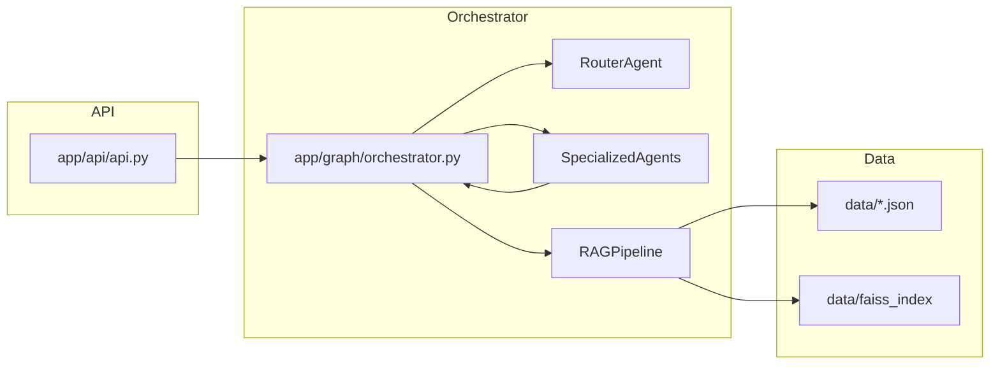
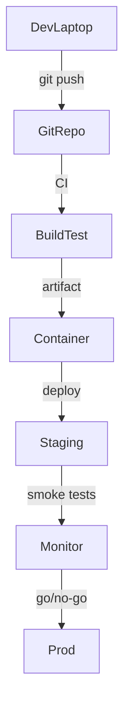

# Customer Support Agent — Architecture and Frontend Integration

## 0. Purpose

This document now provides a comprehensive architecture blueprint for the `customer_support_agent` project, including:
- full endpoint specifications
- agent orchestration and RAG coadd ntext flow
- frontend integration and proxy mapping
- all E2E run and debug steps
- analytic/observability touchpoints
- detailed diagram blocks (Mermaid)

The goal: allow contributors to onboard with the entire system in one pass.

## 1. Project overview

A production-style multi-agent customer support system:
- Python FastAPI backend with router agent and specialized sub-agents
- Retrieval Augmented Generation (RAG) using FAISS + JSON knowledge base
- Two frontend clients: Vue 3 + Vite and Next.js App Router
- Modular design: agents, orchestrator, rag pipeline, api endpoints

Code entrypoints:
- `main.py` (server boot)
- `app/api/api.py` (public API)
- `app/graph/orchestrator.py` (workflow)
- `app/rag/rag_pipeline.py` (knowledge retrieval)
- `app/agents/specialized_agents.py` (domain handling)

## 2. Backend architecture (detailed)

### 2.1 API layer

`app/api/api.py` exposes:
- `GET /health` => service status
- `POST /chat` => model-based answer route
- `POST /match` => semantic KB matching (added) 

Request/response contracts:
- `ChatRequest`: `{ query: str }`
- `ChatResponse`: `{ query, agent, answer, confidence, metadata }`
- `MatchRequest`: `{ query, top_k }`
- `MatchResponse`: `{ query, matches: [{rank, content, metadata}] }`

Cross-origin handling:
- `CORSMiddleware(allow_origins=["*"], allow_methods=["*"], allow_headers=["*"])`

Error handling:
- 400 when query is empty

### 2.2 Orchestrator layer

`app/graph/orchestrator.py` implements `LangGraphOrchestrator`:
- orchestrates query flow
- maintains search history (50 entries)
- route computation + agent dispatch
- fallback to escalation on failure

Runtime workflow:
1. query arrives at `/chat`
2. router decides `target_agent` via `RouterAgent.handle(query)`
3. context collected via `RAGPipeline.retrieve_context(query)`
4. chosen agent executes `handle(query, context_data)`
5. results enriched with metadata (`reason`, `confidence`)
6. history appended, oldest dropped at >50

### 2.3 Agent layer

`app/agents/specialized_agents.py` contains agent classes: `FAQAgent`, `OrderStatusAgent`, etc.

Each agent has:
- `handle(query, context)`
- output: `{ agent, answer, confidence, reason }`

Router & fallback:
- `RouterAgent` uses lightweight keyword heuristics and scoring across agents
- returns `{ match: agent_name, score }`
- default to `escalation_agent`

### 2.4 RAG pipeline

`app/rag/rag_pipeline.py` uses:
- `data/faqs.json`, `data/orders.json`, `data/policies.json`
- `SentenceTransformerEmbeddings(all-MiniLM-L6-v2)`
- `FAISS` vectorstore, loading/saving from `data/faiss_index`

Key methods:
- `_load_documents()` builds docs with metadata and question-answer text
- `_load_or_build_store()` loads existing index or creates one
- `retrieve_context(query)` returns text blob of top results
- `retrieve_matches(query, k)` returns structured match list
- `answer_with_context(query)` uses `OpenAI` + `RetrievalQA`
- `query_rewrite(query)` normalizes user text

### 2.5 Data model

Knowledge files:
- `faqs.json`: FAQ Q&A
- `policies.json`: policy descriptions
- `orders.json`: sample orders with order_id + status

FAISS index path from `config/config.py` as `FAISS_PATH`

### 2.6 Theory and core concepts

This system is built on modern retrieval-augmented generation (RAG) patterns. The core idea is that rather than asking the language model to produce answers from raw query text alone, we provide a compressed and semantically relevant context vector retrieved from a structured knowledge base. This reduces hallucination, improves factual grounding, and enables the model to reuse domain-specific knowledge expressed in `faqs.json`, `policies.json`, and order data.

The agent architecture uses a router-based separation of concerns. A lightweight `RouterAgent` acts as a classifier and delegator, mapping user intent to one of several sandboxed domain agents (FAQ, billing, order status, returns, technical support, etc.). This modularization allows each domain agent to encapsulate business rules, confidence thresholds, and custom prompts. If the router cannot confidently make a match, the system gracefully falls back to an `EscalationAgent`, ensuring the user still receives a truthful, safe response route.

Semantically searching the knowledge base is done via vector embedding with `SentenceTransformerEmbeddings`. Documents are embedded and stored in FAISS for nearest-neighbor lookup. When a query arrives, the top `k` relevant documents are retrieved and joined into a context string. This context can then be used directly by agents or passed through an LLM query chain through `RetrievalQA`, which leverages `OpenAI` to generate a concise user-facing answer.

The multi-stage flow is intentional and theory-aligned:
- input normalization (`query_rewrite`) to reduce variance
- intent classification (`RouterAgent`)
- context retrieval (`RAGPipeline.retrieve_context`)
- specialized handling (`Agent.handle`)
- agent fallback path
- history and explainability metadata (for audit and model behavior tracking)

This architecture supports strong explainability and maintainability; each part can scale individually, and new agents or data sources can be added without rewriting the entire pipeline.

### 2.7 Detailed theoretical flow (multiple steps)

1. User query `Q` arrives through the API.
2. The router computes `P(agent|Q)` using lexical and semantic features. This probabilistic routing is key for scalable domain dispatch.
3. RAG selects top documents `D = {d1, d2, ..., dk}` such that similarity(Q, di) is maximized in vector space.
4. Agent-level logic evaluates `a = agent.handle(Q, context=D)` and may use deterministic rules for known entities (e.g., order_id lookup) and generative completion for open-ended responses.
5. Response is annotated with confidence score and reasoning chain metadata, improving interpretability and enabling future reinforcement learning from user feedback.

This theoretical section sets the groundwork for extension to production robustness:
- add analytics layers to track route accuracy
- implement dynamic retraining of the router using logged queries and agent labels
- replace heuristic routing with supervised model classification over query embeddings
- introduce hybrid retrieval: sparse TF-IDF + dense FAISS for low-latency coverage

## 3. Frontend architecture (detailed)

### 3.1 Common front-end data path

Both frontends submit a request to a local route (`/api/chat`) that is rewritten by the dev server to backend origin `http://localhost:8000`.

1. UI captures text input
2. fetch `POST /api/chat` with JSON body
3. backend replies with agent answer
4. UI renders response

### 3.2 Vue frontend (customer_support_agent/frontend/vue-app)

- `src/App.vue`: single-page UI with state:
  - `query`, `isLoading`, `response`, `error`
- `vite.config.js`:
  - proxy `/api` to `http://localhost:8000`

Request flow:
- UI -> `fetch('/api/chat', {...})` -> Vite proxy -> FastAPI /chat -> orchestrator -> response -> UI

### 3.3 Next.js frontend (customer_support_agent/frontend/next-app)

- `app/page.js`: React component with `useState`, `handleSubmit`
- `next.config.js`: rewrites `/api/:path*` to backend
- This can be extended to use `getServerSideProps` or `app/api` with backend proxy

### 3.4 Raw cross-site and production setup

- either platform can be optionally deployed with a dedicated backend URL variable
- use environment vars:
  - `VITE_CHAT_URL` or `NEXT_PUBLIC_CHAT_URL`
- disable CORS `'*'` in production and set explicit origin list

## 4. End-to-end (E2E) sequence

### 4.1 Full query handling path

1. User on UI enters query.
2. UI POSTs to local endpoint probing source.
3. `app/api/api.py` receives request, validation guard.
4. orchestrator.run() invoked.
  a. router decides targeted agent.
  b. RAG context call includes nearest semantic docs.
  c. agent.handle() uses business rules + may call RAG response path.
5. if agent fails, escalation agent called with fallback reason.
6. orchestrator returns response object.
7. API builds `ChatResponse` and returns HTTP 200.
8. UI renders answer + confidence.
9. history stored in orchestrator for future observability.

### 4.2 New `/match` endpoint path

1. UI (or test) POSTs to `/match` with query string.
2. API calls `RAGPipeline.retrieve_matches()` to get top `k` knowledge chunks.
3. Returns structured match list for human review.

### 4.3 Advanced RAG + QA path (optional)

- when `answer_with_context()` is used, chain does:
  1. Retrieve docs from FAISS as retriever
  2. OpenAI call via `RetrievalQA.from_chain_type(...)`
  3. Generate deep answer from model + context
  4. return final text to agent

## 5. Graph and flow diagrams

### 5.1 High level system flow

```mermaid
flowchart TD
  U(User) -->|ask question| V(Vue/Next UI)
  V -->|POST /api/chat| P[FRONTEND DEV SERVER]
  P -->|proxy /chat| B[FastAPI Backend]
  B -->|orchestrator.run(query)| O[Orchestrator]
  O -->|route query| R[RouterAgent]
  R --> A{Domains}
  A -->|faq| F1[FAQAgent]
  A -->|billing| F2[BillingAgent]
  A -->|order| F3[OrderStatusAgent]
  A -->|returns| F4[ReturnsRefundAgent]
  A -->|technical| F5[TechnicalSupportAgent]
  A -->|etc| F6[EscalationAgent]
  O -->|context| D[RAGPipeline]
  D -->|read| K[Knowledge Data Store]
  K --> FA[faqs/orders/policies/faiss]
  F1 -->|response| O
  F2 --> O
  F3 --> O
  F4 --> O
  F5 --> O
  F6 --> O
  O -->|response| B
  B -->|200| V
  V -->|answer displayed| U
```

### 5.2 Backend module dependency graph



### 5.3 Deployment flow



## 6. Setup guide (copy-paste)

### 6.1 Backend (Python)

```bash
cd customer_support_agent
python3 -m venv venv
source venv/bin/activate
pip install -r requirements.txt
# set OpenAI key
export OPENAI_API_KEY="your-key"
python main.py
```

### 6.2 Frontend (Vue)

```bash
cd customer_support_agent/frontend/vue-app
npm install
npm run dev
```

### 6.3 Frontend (Next)

```bash
cd customer_support_agent/frontend/next-app
npm install
npm run dev
```

## 7. Observability and testing

- `curl http://127.0.0.1:8000/health`
- `curl -X POST http://127.0.0.1:8000/chat -H 'Content-Type: application/json' -d '{"query":"What is your return policy?"}'`
- `curl -X POST http://127.0.0.1:8000/match -H 'Content-Type: application/json' -d '{"query":"shipping", "top_k":3}'`

### 7.1 Logging
- `app/utils/logger.py` manages structured logs.
- add per-agent logs in `handle()` for tracing.

### 7.2 Future enhancements
- add concurrency safety and persisted sessions
- add database for tickets/users
- add OpenTelemetry traces for each API call

## 8. Notes

- This document can be shipped as the canonical architecture review for the sprint demo.
- Replace placeholder environment policies with secure values in production.
