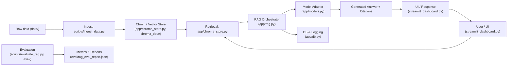

# Project Working Flow

## Purpose
This document explains the high-level runtime and data flow of the repository so a developer can quickly understand how components interact and how to run the project.

## Components (summary)
- `app/` — core backend logic: `main.py`, `db.py`, `models.py`, `rag.py`, `chroma_store.py`, `config.py`, `security.py`.
- `streamlit_dashboard.py`, `streamlit_rag_eval_dashboard.py` — Streamlit UI entrypoints.
- `scripts/` — utilities: `ingest_data.py`, `evaluate_rag.py`, `seed_*`.
- `chroma_data/` — persisted Chroma vector DB (SQLite files and collection folders).
- `data/` — raw source data for ingestion.
- `eval/` — evaluation artifacts like `ground_truth_rag.json` and `rag_eval_report.json`.
- `templates/` and `static/` — frontend HTML/CSS/JS used by any web UI.

## High-level flow (step-by-step)

1. Data ingestion and indexing
   - Run `scripts/ingest_data.py` to convert raw documents in `data/` into embeddings and store them in the Chroma vector store.
   - `ingest_data.py` uses `app/chroma_store.py` (or similar helper) to connect to the Chroma DB in `chroma_data/` and persist embeddings along with metadata.

2. Vector store & retrieval
   - `app/chroma_store.py` provides an abstraction to query and retrieve the top-k nearest document chunks from the Chroma store given a query embedding.
   - Retrieval returns relevant context and metadata to be used by the RAG pipeline.

3. RAG orchestration
   - `app/rag.py` coordinates retrieval and generation: it asks the vector store for context, formats a prompt (with context + user query), then calls the model wrapper in `app/models.py`.
   - `app/models.py` contains the model integration (local LLM, remote LLM API, or an adapter) and returns generated answers. It also may apply prompt templates and safety filters.

4. Database & state
   - `app/db.py` persists conversation history, user sessions, or metadata (SQLite or other store). This enables conversation continuity and evaluation logging.

5. Authentication & security
   - `app/security.py` implements authentication/authorization logic used by the web UI or APIs (login templates live in `templates/`).

6. Web UI / API
   - The interactive UI can be started with `streamlit_dashboard.py` (Streamlit) or by running `app/main.py` if it exposes a webserver.
   - The UI accepts user input, calls the RAG pipeline (via `app/rag.py`), and displays answers along with source citations and metadata.

7. Evaluation
   - `scripts/evaluate_rag.py` runs RAG evaluation using files in `eval/` (for example, comparing generated outputs against `ground_truth_rag.json`) and writes metrics to `rag_eval_report.json`.

## Flow Diagram



## Typical developer commands

1. create and activate venv (if needed)

```bash
python -m venv .venv
source .venv/bin/activate
pip install -r requirements.txt
```

2. Ingest documents into Chroma

```bash
python scripts/ingest_data.py
```

3. Run the Streamlit UI

```bash
streamlit run streamlit_dashboard.py
```

4. Run evaluation

```bash
python scripts/evaluate_rag.py
```

## File-to-function mapping (quick)
- `scripts/ingest_data.py` — ingestion pipeline → `app/chroma_store.py`
- `app/chroma_store.py` — Chroma DB wrapper (save, query)
- `app/rag.py` — retrieval + prompt composition
- `app/models.py` — model API/adapter for generation
- `app/db.py` — persistence (conversations, metadata)
- `app/security.py` — auth helpers used by UI
- `streamlit_dashboard.py` — user-facing UI that wires everything together

## Notes & next steps
- Inspect `app/config.py` for environment variables and model/Chroma config before running.
- If Chroma is large or remote, adjust connection settings in `app/chroma_store.py`.
- For reproducible evaluation, check `eval/ground_truth_rag.json` and `scripts/evaluate_rag.py`.

---
This file is a concise overview intended to help developers understand runtime flow and where to look for implementation details.
